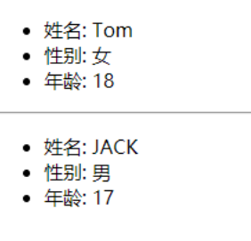

# 第1章：React入门

## React简介

### 官网

1.  英文官网: <https://reactjs.org/>

2.  中文官网: https://react.docschina.org/

### 介绍描述 

1.  用于动态构建用户界面的 JavaScript 库(只关注于视图)

2.  由Facebook开源

### React的特点

1.  声明式编码

2.  组件化编码

3.  React Native 编写原生应用

4.  高效（优秀的Diffing算法）

### React高效的原因

1.  使用虚拟(virtual)DOM, 不总是直接操作页面真实DOM。

2.  DOM Diffing算法, 最小化页面重绘。

## React的基本使用

### 效果


### 相关js库

1.  react.js：React核心库。

2.  react-dom.js：提供操作DOM的react扩展库。

3.  babel.min.js：解析JSX语法代码转为JS代码的库。

### 创建虚拟DOM的两种方式


1. 纯JS方式(一般不用)

   ```javascript
   <!DOCTYPE html>
   <html lang="en">
   <head>
   	<meta charset="UTF-8">
   	<title>2_使用js创建虚拟DOM</title>
   </head>
   <body>
   	<!-- 准备好一个“容器” -->
   	<div id="test"></div>
   
   	<!-- 引入react核心库 -->
   	<script type="text/javascript" src="../js/react.development.js"></script>
   	<!-- 引入react-dom，用于支持react操作DOM -->
   	<script type="text/javascript" src="../js/react-dom.development.js"></script>
   
   	<script type="text/javascript" > 
   		//1.创建虚拟DOM
   		const VDOM = React.createElement('h1',{id:'title'},React.createElement('span',{},'Hello,React'))
   		//2.渲染虚拟DOM到页面
   		ReactDOM.render(VDOM,document.getElementById('test'))
   	</script>
   </body>
   </html>
   ```

   

2. JSX方式

   ```javascript
   <!DOCTYPE html>
   <html lang="en">
   <head>
   	<meta charset="UTF-8">
   	<title>1_使用jsx创建虚拟DOM</title>
   </head>
   <body>
   	<!-- 准备好一个“容器” -->
   	<div id="test"></div>
   
   	<!-- 引入react核心库 -->
   	<script type="text/javascript" src="../js/react.development.js"></script>
   	<!-- 引入react-dom，用于支持react操作DOM -->
   	<script type="text/javascript" src="../js/react-dom.development.js"></script>
   	<!-- 引入babel，用于将jsx转为js -->
   	<script type="text/javascript" src="../js/babel.min.js"></script>
   
   	<script type="text/babel" > /* 此处一定要写babel */
   		//1.创建虚拟DOM
   		const VDOM = (  /* 此处一定不要写引号，因为不是字符串 */
   			<h1 id="title">
   				<span>Hello,React</span>
   			</h1>
   		)
   		//2.渲染虚拟DOM到页面
   		ReactDOM.render(VDOM,document.getElementById('test'))
   	</script>
   </body>
   </html>
   ```

   

### 虚拟DOM与真实DOM

1. React提供了一些API来创建一种 "特别" 的一般js对象

   -   **const VDOM = React.createElement(\'xx\',{id:\'xx\'},\'xx\')**

   -   上面创建的就是一个简单的虚拟DOM对象

2. 虚拟DOM对象最终都会被React转换为真实的DOM

3. 我们编码时基本只需要操作react的虚拟DOM相关数据,
   react会转换为真实DOM变化而更新界。

   ```javascript
   <!DOCTYPE html>
   <html lang="en">
   <head>
   	<meta charset="UTF-8">
   	<title>3_虚拟DOM与真实DOM</title>
   </head>
   <body>
   	<!-- 准备好一个“容器” -->
   	<div id="test"></div>
   	<div id="demo"></div>
   
   	<!-- 引入react核心库 -->
   	<script type="text/javascript" src="../js/react.development.js"></script>
   	<!-- 引入react-dom，用于支持react操作DOM -->
   	<script type="text/javascript" src="../js/react-dom.development.js"></script>
   	<!-- 引入babel，用于将jsx转为js -->
   	<script type="text/javascript" src="../js/babel.min.js"></script>
   
   	<script type="text/babel" > /* 此处一定要写babel */
   		//1.创建虚拟DOM
   		const VDOM = (  /* 此处一定不要写引号，因为不是字符串 */
   			<h1 id="title">
   				<span>Hello,React</span>
   			</h1>
   		)
   		//2.渲染虚拟DOM到页面
   		ReactDOM.render(VDOM,document.getElementById('test'))
   
   		const TDOM = document.getElementById('demo')
   		console.log('虚拟DOM',VDOM);
   		console.log('真实DOM',TDOM);
   		debugger;
   		// console.log(typeof VDOM);
   		// console.log(VDOM instanceof Object);
   		/* 
   				关于虚拟DOM：
   					1.本质是Object类型的对象（一般对象）
   					2.虚拟DOM比较“轻”，真实DOM比较“重”，因为虚拟DOM是React内部在用，无需真实DOM上那么多的属性。
   					3.虚拟DOM最终会被React转化为真实DOM，呈现在页面上。
   		 */
   	</script>
   </body>
   </html>
   ```

   

## React JSX

### 效果


### JSX

1.  全称: JavaScript XML
2.  react定义的一种类似于XML的JS扩展语法: JS +
    XML本质是**React.createElement(component, props, \...children)**方法的语法糖
3.  作用: 用来简化创建虚拟DOM

    1.  写法：**var ele = \<h1\>Hello JSX!\</h1\>**

    2.  注意1：它不是字符串, 也不是HTML/XML标签

    3.  注意2：它最终产生的就是一个JS对象
4.  标签名任意: HTML标签或其它标签
5.  标签属性任意: HTML标签属性或其它
6.  基本语法规则

    1.  遇到 \<开头的代码, 以标签的语法解析:
        html同名标签转换为html同名元素, 其它标签需要特别解析

    2.  遇到以 { 开头的代码，以JS语法解析: 标签中的js表达式必须用{ }包含
7.  babel.js的作用

    1.  浏览器不能直接解析JSX代码, 需要babel转译为纯JS的代码才能运行
2.  只要用了JSX，都要加上type=\"text/babel\", 声明需要babel来处理

```javascript
<!DOCTYPE html>
<html lang="en">
<head>
	<meta charset="UTF-8">
	<title>jsx语法规则</title>
	<style>
		.title{
			background-color: orange;
			width: 200px;
		}
	</style>
</head>
<body>
	<!-- 准备好一个“容器” -->
	<div id="test"></div>

	<!-- 引入react核心库 -->
	<script type="text/javascript" src="../js/react.development.js"></script>
	<!-- 引入react-dom，用于支持react操作DOM -->
	<script type="text/javascript" src="../js/react-dom.development.js"></script>
	<!-- 引入babel，用于将jsx转为js -->
	<script type="text/javascript" src="../js/babel.min.js"></script>

	<script type="text/babel" >
		const myId = 'aTgUiGu'
		const myData = 'HeLlo,rEaCt'

		//1.创建虚拟DOM
		const VDOM = (
			<div>
				<h2 className="title" id={myId.toLowerCase()}>
					<span style={{color:'white',fontSize:'29px'}}>{myData.toLowerCase()}</span>
				</h2>
				<h2 className="title" id={myId.toUpperCase()}>
					<span style={{color:'white',fontSize:'29px'}}>{myData.toLowerCase()}</span>
				</h2>
				<input type="text"/>
			</div>
		)
		//2.渲染虚拟DOM到页面
		ReactDOM.render(VDOM,document.getElementById('test'))

		/* 
				jsx语法规则：
						1.定义虚拟DOM时，不要写引号。
						2.标签中混入JS表达式时要用{}。
						3.样式的类名指定不要用class，要用className。
						4.内联样式，要用style={{key:value}}的形式去写。
						5.只有一个根标签
						6.标签必须闭合
						7.标签首字母
								(1).若小写字母开头，则将该标签转为html中同名元素，若html中无该标签对应的同名元素，则报错。
								(2).若大写字母开头，react就去渲染对应的组件，若组件没有定义，则报错。
		 */
	</script>
</body>
</html>
```


### 渲染虚拟DOM(元素)

1.  语法: **ReactDOM.render(virtualDOM, containerDOM)**

2.  作用: 将虚拟DOM元素渲染到页面中的真实容器DOM中显示

3.  参数说明

    1.  参数一: 纯js或jsx创建的虚拟dom对象

    2.  参数二: 用来包含虚拟DOM元素的真实dom元素对象(一般是一个div)

### JSX练习

需求: 动态展示如下列表


```javascript
<!DOCTYPE html>
<html lang="en">
<head>
	<meta charset="UTF-8">
	<title>jsx小练习</title>
</head>
<body>
	<!-- 准备好一个“容器” -->
	<div id="test"></div>
	
	<!-- 引入react核心库 -->
	<script type="text/javascript" src="../js/react.development.js"></script>
	<!-- 引入react-dom，用于支持react操作DOM -->
	<script type="text/javascript" src="../js/react-dom.development.js"></script>
	<!-- 引入babel，用于将jsx转为js -->
	<script type="text/javascript" src="../js/babel.min.js"></script>

	<script type="text/babel" >
		/* 
			一定注意区分：【js语句(代码)】与【js表达式】
					1.表达式：一个表达式会产生一个值，可以放在任何一个需要值的地方
								下面这些都是表达式：
										(1). a
										(2). a+b
										(3). demo(1)
										(4). arr.map() 
										(5). function test () {}
					2.语句(代码)：
								下面这些都是语句(代码)：
										(1).if(){}
										(2).for(){}
										(3).switch(){case:xxxx}
		
	 */
		//模拟一些数据
		const data = ['Angular','React','Vue']
		//1.创建虚拟DOM
		const VDOM = (
			<div>
				<h1>前端js框架列表</h1>
				<ul>
					{
						data.map((item,index)=>{
							return <li key={index}>{item}</li>
						})
					}
				</ul>
			</div>
		)
		//2.渲染虚拟DOM到页面
		ReactDOM.render(VDOM,document.getElementById('test'))
	</script>
</body>
</html>
```


## 模块与组件、模块化与组件化的理解

### 模块

1.  理解：向外提供特定功能的js程序, 一般就是一个js文件

2.  为什么要拆成模块：随着业务逻辑增加，代码越来越多且复杂。

3.  作用：复用js, 简化js的编写, 提高js运行效率

### 组件

1.  理解：用来实现局部功能效果的代码和资源的集合(html/css/js/image等等)

2.  为什么要用组件： 一个界面的功能更复杂

3.  作用：复用编码, 简化项目编码, 提高运行效率

### 模块化

当应用的js都以模块来编写的, 这个应用就是一个模块化的应用

### 组件化

当应用是以多组件的方式实现, 这个应用就是一个组件化的应用


# 第2章：React面向组件编程

## 2.1. 基本理解和使用

### 2.1.1. 使用React开发者工具调试


### 2.1.2. 效果

函数式组件：


类式组件：


### 2.1.3. 注意

1.  组件名必须首字母大写

2.  虚拟DOM元素只能有一个根元素

3.  虚拟DOM元素必须有结束标签

### 2.1.4. 渲染类组件标签的基本流程

1.  React内部会创建组件实例对象

2.  调用render()得到虚拟DOM, 并解析为真实DOM

3.  插入到指定的页面元素内部

## 2.2. 组件三大核心属性1: state

### 2.2.1. 效果

*需求: 定义一个展示天气信息的组件*

1.  *默认展示天气炎热 或 凉爽*

2.  *点击文字切换天气*


### 2.2.2. 理解

1.  state是组件对象最重要的属性, 值是对象(可以包含多个key-value的组合)

2.  组件被称为\"状态机\",
    通过更新组件的state来更新对应的页面显示(重新渲染组件)

### 2.2.3. 强烈注意

1.  组件中render方法中的this为组件实例对象

2.  组件自定义的方法中this为undefined，如何解决？

    a.  强制绑定this: 通过函数对象的bind()

    b.  箭头函数

3.  状态数据，不能直接修改或更新

## 2.3. 组件三大核心属性2: props

### 2.3.1. 效果

*需求: 自定义用来显示一个人员信息的组件*

1.  *姓名必须指定，且为字符串类型；*

2.  *性别为字符串类型，如果性别没有指定，默认为男*

3.  *年龄为字符串类型，且为数字类型，默认值为18*



### 2.3.2. 理解

1.  每个组件对象都会有props(properties的简写)属性

2.  组件标签的所有属性都保存在props中

### 2.3.3. 作用

1.  通过标签属性从组件外向组件内传递变化的数据

2.  注意: 组件内部不要修改props数据

### 2.3.4. 编码操作

1. 内部读取某个属性值

   - ```javascript
     this.props.name
     ```

2. 对props中的属性值进行类型限制和必要性限制

> 第一种方式（React v15.5 开始已弃用）：

```javascript
Person.propTypes = {
 name: React.PropTypes.string.isRequired,
 age: React.PropTypes.number
}
```


第二种方式（新）：使用prop-types库进限制（需要引入prop-types库）

```javascript
Person.propTypes = {
  name: PropTypes.string.isRequired,
  age: PropTypes.number. 
}
```


3. 扩展属性: 将对象的所有属性通过props传递

   ```javascript
   <Person {...person}/>
   ```

4. 默认属性值：

   ````javascript
   Person.defaultProps = {
     age: 18,
     sex:'男'
   }
   ````

5. 组件类的构造函数

   ```javascript
   constructor(props){
     super(props)
     console.log(props)//打印所有属性
   }
   ```

   

## 2.4. 组件三大核心属性3: refs与事件处理

### 2.4.1. 效果

*需求: 自定义组件, 功能说明如下:*

*1. 点击按钮, 提示第一个输入框中的值*

*2. 当第2个输入框失去焦点时, 提示这个输入框中的值*

效果如下：


### 2.4.2. 理解

组件内的标签可以定义ref属性来标识自己

### 2.4.3. 编码

1. 字符串形式的ref

   ```javascript
   <input ref="input1"/>
   ```

2. 回调形式的ref

   ```javascript
   <input ref={(c)=>{this.input1 = c}}
   ```

3. createRef创建ref容器·

   ```javascript
   myRef = React.createRef() 
   <input ref={this.myRef}/>
   ```

### 2.4.4. 事件处理

1.  通过onXxx属性指定事件处理函数(注意大小写)

    1.  React使用的是自定义(合成)事件, 而不是使用的原生DOM事件

    2.  React中的事件是通过事件委托方式处理的(委托给组件最外层的元素)

2.  通过event.target得到发生事件的DOM元素对象

## 2.5. 收集表单数据

### 2.5.1. 效果

*需求: 定义一个包含表单的组件*

*输入用户名密码后, 点击登录提示输入信息*


### 2.5.2. 理解

包含表单的组件分类

1.  受控组件

2.  非受控组件

## 2.6. 组件的生命周期

### 2.6.1. 效果

*需求:定义组件实现以下功能：*

*1. 让指定的文本做显示 / 隐藏的渐变动画*

*2. 从完全可见，到彻底消失，耗时2S*

*3. 点击"不活了"按钮从界面中卸载组件*


### 2.6.2. 理解

1.  组件从创建到死亡它会经历一些特定的阶段。

2.  React组件中包含一系列勾子函数(生命周期回调函数),
    会在特定的时刻调用。

3.  我们在定义组件时，会在特定的生命周期回调函数中，做特定的工作。

### 2.6.3. 生命周期流程图(旧) 


生命周期的三个阶段（旧）


**1. 初始化阶段:** 由ReactDOM.render()触发\-\--初次渲染

1.  constructor()

2.  componentWillMount()

3.  render()

4.  componentDidMount()

**2. 更新阶段:** 由组件内部this.setSate()或父组件重新render触发

1.  shouldComponentUpdate()

2.  componentWillUpdate()

3.  render()

4.  componentDidUpdate()

**3. 卸载组件:** 由ReactDOM.unmountComponentAtNode()触发

1.  componentWillUnmount()

### 2.6.4. 生命周期流程图(新)


生命周期的三个阶段（新）

**1. 初始化阶段:** 由ReactDOM.render()触发\-\--初次渲染

1.  constructor()

2.  **getDerivedStateFromProps**

3.  render()

4.  componentDidMount()

**2. 更新阶段:** 由组件内部this.setSate()或父组件重新render触发

1.  **getDerivedStateFromProps**

2.  shouldComponentUpdate()

3.  render()

4.  **getSnapshotBeforeUpdate**

5.  componentDidUpdate()

**3. 卸载组件:** 由ReactDOM.unmountComponentAtNode()触发

1.  componentWillUnmount()

### 2.6.5. 重要的勾子

1.  render：初始化渲染或更新渲染调用

2.  componentDidMount：开启监听, 发送ajax请求

3.  componentWillUnmount：做一些收尾工作, 如: 清理定时器

### 2.6.6. 即将废弃的勾子

1.  componentWillMount

2.  componentWillReceiveProps

3.  componentWillUpdate

现在使用会出现警告，下一个大版本需要加上UNSAFE_前缀才能使用，以后可能会被彻底废弃，不建议使用。

## 2.7. 虚拟DOM与DOM Diffing算法

### 2.7.1. 效果

*需求：验证虚拟DOM Diffing算法的存在*

### 2.7.2. 基本原理图


# 第3章：React应用(基于React脚手架)

## 3.1. 使用create-react-app创建react应用

### 3.1.1. react脚手架

1.  xxx脚手架: 用来帮助程序员快速创建一个基于xxx库的模板项目

    1.  包含了所有需要的配置（语法检查、jsx编译、devServer...）

    2.  下载好了所有相关的依赖

    3.  可以直接运行一个简单效果

2.  react提供了一个用于创建react项目的脚手架库: create-react-app

3.  项目的整体技术架构为: react + webpack + es6 + eslint

4.  使用脚手架开发的项目的特点: 模块化, 组件化, 工程化

### 3.1.2. 创建项目并启动

> **第一步**，全局安装：**npm i -g create-react-app**
>
> **第二步**，切换到想创项目的目录，使用命令：**create-react-app**
> **hello-react**
>
> **第三步**，进入项目文件夹：**cd hello-react**
>
> **第四步**，启动项目：**npm start**

### 3.1.3. react脚手架项目结构

> public \-\-\-- 静态资源文件夹
>
> favicon.icon \-\-\-\-\-- 网站页签图标
>
> **index.html \-\-\-\-\-\-\-- 主页面**
>
> logo192.png \-\-\-\-\-\-- logo图
>
> logo512.png \-\-\-\-\-\-- logo图
>
> manifest.json \-\-\-\-- 应用加壳的配置文件
>
> robots.txt \-\-\-\-\-\-\-- 爬虫协议文件
>
> src \-\-\-- 源码文件夹
>
> App.css \-\-\-\-\-\-\-- App组件的样式
>
> **App.js \-\-\-\-\-\-\-\-- App组件**
>
> App.test.js \-\-\-- 用于给App做测试
>
> index.css \-\-\-\-\-- 样式
>
> **index.js \-\-\-\-\-\-- 入口文件**
>
> logo.svg \-\-\-\-\-\-- logo图
>
> reportWebVitals.js
>
> \-\-- 页面性能分析文件(需要web-vitals库的支持)
>
> setupTests.js
>
> \-\-\-- 组件单元测试的文件(需要jest-dom库的支持)

### 3.1.4. 功能界面的组件化编码流程（通用）

1\. 拆分组件: 拆分界面,抽取组件

2\. 实现静态组件: 使用组件实现静态页面效果

3\. 实现动态组件

> 3.1 动态显示初始化数据
>
> 3.1.1 数据类型
>
> 3.1.2 数据名称
>
> 3.1.2 保存在哪个组件?
>
> 3.2 交互(从绑定事件监听开始)

## 3.2. 组件的组合使用-TodoList 

*功能: 组件化实现此功能*

*1. 显示所有todo列表*

*2. 输入文本, 点击按钮显示到列表的首位, 并清除输入的文本*


# 第4章：React ajax 

## 4.1. 理解

### 4.1.1. 前置说明

1.  React本身只关注于界面, 并不包含发送ajax请求的代码

2.  前端应用需要通过ajax请求与后台进行交互(json数据)

3.  react应用中需要集成第三方ajax库(或自己封装)

### 4.1.2. 常用的ajax请求库

1.  jQuery: 比较重, 如果需要另外引入不建议使用

2.  axios: 轻量级, 建议使用

    1.  封装XmlHttpRequest对象的ajax

    2.  promise风格

    3.  可以用在浏览器端和node服务器端

## 4.2. axios

### 4.2.1. 文档

<https://github.com/axios/axios>

### 4.2.2. 相关API

1)  GET请求

```javascript
axios.get('/user?ID=12345')
  .then(function (response) {
    console.log(response.data);
  })
  .catch(function (error) {
    console.log(error);
  });

axios.get('/user', {
    params: {
      ID: 12345
    }
  })
  .then(function (response) {
    console.log(response);
  })
  .catch(function (error) {
    console.log(error);
  });
```

2)  POST请求

```javascript
axios.post('/user', {
  firstName: 'Fred',
  lastName: 'Flintstone'
})
.then(function (response) {
console.log(response);
})
.catch(function (error) {
console.log(error);
});
```

## 4.3. 案例---github用户搜索

### 4.3.1. 效果


请求地址: <https://api.github.com/search/users?q=xxxxxx>

## 4.4. 消息订阅-发布机制 

1.  工具库: PubSubJS

2.  下载: npm install pubsub-js \--save

3.  使用:

    1.  import PubSub from \'pubsub-js\' //引入

    2.  PubSub.subscribe(\'delete\', function(data){ }); //订阅

    3.  PubSub.publish(\'delete\', data) //发布消息

## 4.5. 扩展：Fetch

### 4.5.1. 文档

1.  [[https://github.github.io/fetch/]{.underline}](https://github.github.io/fetch/)

2.  [[https://segmentfault.com/a/1190000003810652]{.underline}](https://segmentfault.com/a/1190000003810652)

### 4.5.2. 特点

1.  fetch: 原生函数，不再使用XmlHttpRequest对象提交ajax请求

2.  老版本浏览器可能不支持

### 4.5.3. 相关API

1)  GET请求

```javascript
fetch(url).then(function(response) {
    return response.json()
  }).then(function(data) {
    console.log(data)
  }).catch(function(e) {
    console.log(e)
  });
```

2)  POST请求

```javascript
fetch(url, {
    method: "POST",
    body: JSON.stringify(data),
  }).then(function(data) {
    console.log(data)
  }).catch(function(e) {
    console.log(e)
  })
```

# 第5章：React路由

## 5.1. 相关理解 

### 5.1.1. SPA的理解

1.  单页Web应用（single page web application，SPA）。

2.  整个应用只有**一个完整的页面**。

3.  点击页面中的链接**不会刷新**页面，只会做页面的**局部更新。**

4.  数据都需要通过ajax请求获取, 并在前端异步展现。

### 5.1.2. 路由的理解

1.  **什么是路由?**

    1.  一个路由就是一个映射关系(key:value)

    2.  key为路径, value可能是function或component

2.  **路由分类**

    1.  后端路由：

        1.  理解： value是function, 用来处理客户端提交的请求。

        2.  注册路由： router.get(path, function(req, res))

        3.  工作过程：当node接收到一个请求时,
            根据请求路径找到匹配的路由, 调用路由中的函数来处理请求,
            返回响应数据

    2.  前端路由：

        1.  浏览器端路由，value是component，用于展示页面内容。

        2.  注册路由: \<Route path=\"/test\" component={Test}\>

        3.  工作过程：当浏览器的path变为/test时,
            当前路由组件就会变为Test组件

### 5.1.3. react-router-dom的理解 

1.  react的一个插件库。

2.  专门用来实现一个SPA应用。

3.  基于react的项目基本都会用到此库。

## 5.2. react-router-dom相关API

### 5.2.1. 内置组件

1.  \<BrowserRouter\>

2.  \<HashRouter\>

3.  \<Route\>

4.  \<Redirect\>

5.  \<Link\>

6.  \<NavLink\>

7.  \<Switch\>

### 5.2.2. 其它

1.  history对象

2.  match对象

3.  withRouter函数

## 5.3. 基本路由使用

### 5.3.1. 效果


### 5.3.2. 准备

1.  下载react-router-dom: npm install \--save react-router-dom

2.  引入bootstrap.css: \<link rel=\"stylesheet\"
    href=\"/css/bootstrap.css\"\>

## 5.4. 嵌套路由使用

### 效果


## 5.5. 向路由组件传递参数数据

### 效果


## 5.6. 多种路由跳转方式

### 效果


# 第6章：React UI组件库

## 6.1.流行的开源React UI组件库

### 6.1.1. material-ui(国外)

1.  官网: <http://www.material-ui.com/#/>

2.  github: <https://github.com/callemall/material-ui>

### 6.1.2. ant-design(国内蚂蚁金服)

1.  官网: <https://ant.design/index-cn>

2.  Github: <https://github.com/ant-design/ant-design/>

# 第7章：redux

## 7.1. redux理解

### 7.1.1. 学习文档

1.  英文文档: <https://redux.js.org/>

2.  中文文档: <http://www.redux.org.cn/>

3.  Github: <https://github.com/reactjs/redux>

### 7.1.2. redux是什么

1.  redux是一个专门用于做**状态管理**的JS库(不是react插件库)。

2.  它可以用在react, angular, vue等项目中, 但基本与react配合使用。

3.  作用: 集中式管理react应用中多个组件**共享**的状态。

### 7.1.3. 什么情况下需要使用redux

1.  某个组件的状态，需要让其他组件可以随时拿到（共享）。

2.  一个组件需要改变另一个组件的状态（通信）。

3.  总体原则：能不用就不用, 如果不用比较吃力才考虑使用。

### 7.1.4. redux工作流程


## 7.2. redux的三个核心概念

### 7.2.1. action

1.  动作的对象

2.  包含2个属性

    -   type：标识属性, 值为字符串, 唯一, 必要属性

    -   data：数据属性, 值类型任意, 可选属性

3.  例子：{ type: \'ADD_STUDENT\',data:{name: \'tom\',age:18} }

### 7.2.2. reducer

1.  用于初始化状态、加工状态。

2.  加工时，根据旧的state和action， 产生新的state的**纯函数。**

### 7.2.3. store

1.  将state、action、reducer联系在一起的对象

2.  如何得到此对象?

    1.  import {createStore} from \'redux\'

    2.  import reducer from \'./reducers\'

    3.  const store = createStore(reducer)

3.  此对象的功能?

    1.  getState(): 得到state

    2.  dispatch(action): 分发action, 触发reducer调用, 产生新的state

    3.  subscribe(listener): 注册监听, 当产生了新的state时, 自动调用

## 7.3. redux的核心API

### 7.3.1. createstore()

> 作用：创建包含指定reducer的store对象

### 7.3.2. store对象

1.  作用: redux库最核心的管理对象

2.  它内部维护着:

    1.  state

    2.  reducer

3.  核心方法:

    1.  getState()

    2.  dispatch(action)

    3.  subscribe(listener)

4.  具体编码:

    1.  store.getState()

    2.  store.dispatch({type:\'INCREMENT\', number})

    3.  store.subscribe(render)

### 7.3.3. applyMiddleware()

> 作用：应用上基于redux的中间件(插件库)

### 7.3.4. combineReducers()

> 作用：合并多个reducer函数

## 7.4. 使用redux编写应用

**效果**


## 7.5. redux异步编程

### 7.5.1理解：

1.  redux默认是不能进行异步处理的,

2.  某些时候应用中需要在**redux中执行异步任务**(ajax, 定时器)

### 7.5.2. 使用异步中间件

> [npm install \--save redux-thunk]{.mark}

## 7.6. react-redux {#react-redux .unnumbered}

### 7.6.1. 理解

1.  一个react插件库

2.  专门用来简化react应用中使用redux

### 7.6.2. react-Redux将所有组件分成两大类

1.  UI组件

    1.  只负责 UI 的呈现，不带有任何业务逻辑

    2.  通过props接收数据(一般数据和函数)

    3.  不使用任何 Redux 的 API

    4.  一般保存在components文件夹下

2.  容器组件

    1.  负责管理数据和业务逻辑，不负责UI的呈现

    2.  使用 Redux 的 API

    3.  一般保存在containers文件夹下

### 7.6.3. 相关API

1. Provider：让所有组件都可以得到state数据

   ```javascript
   <Provider store={store}>
     <App />
   </Provider>
   ```

2. connect：用于包装 UI 组件生成容器组件

   ```javascript
   import { connect } from 'react-redux'
     connect(
       mapStateToprops,
       mapDispatchToProps
     )(Counter)
   ```

   

3. mapStateToprops：将外部的数据（即state对象）转换为UI组件的标签属性

   ```javascript
   const mapStateToprops = function (state) {
     return {
       value: state
     }
   }
   ```

   

4. mapDispatchToProps：将分发action的函数转换为UI组件的标签属性

## 7.7. 使用上redux调试工具

### 7.7.1. 安装chrome浏览器插件


### 7.7.2. 下载工具依赖包

npm install \--save-dev redux-devtools-extension

## 7.8. 纯函数和高阶函数

### 7.8.1. 纯函数

1.  一类特别的函数: 只要是同样的输入(实参)，必定得到同样的输出(返回)

2.  必须遵守以下一些约束  

    1.  不得改写参数数据

    2.  不会产生任何副作用，例如网络请求，输入和输出设备

    3.  不能调用Date.now()或者Math.random()等不纯的方法  

3.  redux的reducer函数必须是一个纯函数

### 7.8.2. 高阶函数

1.  理解: 一类特别的函数

    1.  情况1: 参数是函数

    2.  情况2: 返回是函数

```{=html}
<!-- -->
```
2.  常见的高阶函数:

    1.  定时器设置函数

    2.  数组的forEach()/map()/filter()/reduce()/find()/bind()

    3.  promise

    4.  react-redux中的connect函数

```{=html}
<!-- -->
```
3.  作用: 能实现更加动态, 更加可扩展的功能

# React扩展

## 1. setState

### setState更新状态的2种写法

```
	(1). setState(stateChange, [callback])------对象式的setState
            1.stateChange为状态改变对象(该对象可以体现出状态的更改)
            2.callback是可选的回调函数, 它在状态更新完毕、界面也更新后(render调用后)才被调用
					
	(2). setState(updater, [callback])------函数式的setState
            1.updater为返回stateChange对象的函数。
            2.updater可以接收到state和props。
            4.callback是可选的回调函数, 它在状态更新、界面也更新后(render调用后)才被调用。
总结:
		1.对象式的setState是函数式的setState的简写方式(语法糖)
		2.使用原则：
				(1).如果新状态不依赖于原状态 ===> 使用对象方式
				(2).如果新状态依赖于原状态 ===> 使用函数方式
				(3).如果需要在setState()执行后获取最新的状态数据, 
					要在第二个callback函数中读取
```


------


## 2. lazyLoad

### 路由组件的lazyLoad

```js
	//1.通过React的lazy函数配合import()函数动态加载路由组件 ===> 路由组件代码会被分开打包
	const Login = lazy(()=>import('@/pages/Login'))
	
	//2.通过<Suspense>指定在加载得到路由打包文件前显示一个自定义loading界面
	<Suspense fallback={<h1>loading.....</h1>}>
        <Switch>
            <Route path="/xxx" component={Xxxx}/>
            <Redirect to="/login"/>
        </Switch>
    </Suspense>
```


------


## 3. Hooks

#### 1. React Hook/Hooks是什么?

```
(1). Hook是React 16.8.0版本增加的新特性/新语法
(2). 可以让你在函数组件中使用 state 以及其他的 React 特性
```

#### 2. 三个常用的Hook

```
(1). State Hook: React.useState()
(2). Effect Hook: React.useEffect()
(3). Ref Hook: React.useRef()
```

#### 3. State Hook

```
(1). State Hook让函数组件也可以有state状态, 并进行状态数据的读写操作
(2). 语法: const [xxx, setXxx] = React.useState(initValue)  
(3). useState()说明:
        参数: 第一次初始化指定的值在内部作缓存
        返回值: 包含2个元素的数组, 第1个为内部当前状态值, 第2个为更新状态值的函数
(4). setXxx()2种写法:
        setXxx(newValue): 参数为非函数值, 直接指定新的状态值, 内部用其覆盖原来的状态值
        setXxx(value => newValue): 参数为函数, 接收原本的状态值, 返回新的状态值, 内部用其覆盖原来的状态值
```

#### 4. Effect Hook

```
(1). Effect Hook 可以让你在函数组件中执行副作用操作(用于模拟类组件中的生命周期钩子)
(2). React中的副作用操作:
        发ajax请求数据获取
        设置订阅 / 启动定时器
        手动更改真实DOM
(3). 语法和说明: 
        useEffect(() => { 
          // 在此可以执行任何带副作用操作
          return () => { // 在组件卸载前执行
            // 在此做一些收尾工作, 比如清除定时器/取消订阅等
          }
        }, [stateValue]) // 如果指定的是[], 回调函数只会在第一次render()后执行
    
(4). 可以把 useEffect Hook 看做如下三个函数的组合
        componentDidMount()
        componentDidUpdate()
    	componentWillUnmount() 
```

#### 5. Ref Hook

```
(1). Ref Hook可以在函数组件中存储/查找组件内的标签或任意其它数据
(2). 语法: const refContainer = useRef()
(3). 作用:保存标签对象,功能与React.createRef()一样
```


------


## 4. Fragment

### 使用

	<Fragment><Fragment>
	<></>

### 作用

> 可以不用必须有一个真实的DOM根标签了


<hr/>

## 5. Context

### 理解

> 一种组件间通信方式, 常用于【祖组件】与【后代组件】间通信

### 使用

```js
1) 创建Context容器对象：
	const XxxContext = React.createContext()  
	
2) 渲染子组时，外面包裹xxxContext.Provider, 通过value属性给后代组件传递数据：
	<xxxContext.Provider value={数据}>
		子组件
    </xxxContext.Provider>
    
3) 后代组件读取数据：

	//第一种方式:仅适用于类组件 
	  static contextType = xxxContext  // 声明接收context
	  this.context // 读取context中的value数据
	  
	//第二种方式: 函数组件与类组件都可以
	  <xxxContext.Consumer>
	    {
	      value => ( // value就是context中的value数据
	        要显示的内容
	      )
	    }
	  </xxxContext.Consumer>
```

### 注意

	在应用开发中一般不用context, 一般都用它的封装react插件


<hr/>


## 6. 组件优化

### Component的2个问题 

> 1. 只要执行setState(),即使不改变状态数据, 组件也会重新render() ==> 效率低
>
> 2. 只当前组件重新render(), 就会自动重新render子组件，纵使子组件没有用到父组件的任何数据 ==> 效率低

### 效率高的做法

>  只有当组件的state或props数据发生改变时才重新render()

### 原因

>  Component中的shouldComponentUpdate()总是返回true

### 解决

	办法1: 
		重写shouldComponentUpdate()方法
		比较新旧state或props数据, 如果有变化才返回true, 如果没有返回false
	办法2:  
		使用PureComponent
		PureComponent重写了shouldComponentUpdate(), 只有state或props数据有变化才返回true
		注意: 
			只是进行state和props数据的浅比较, 如果只是数据对象内部数据变了, 返回false  
			不要直接修改state数据, 而是要产生新数据
	项目中一般使用PureComponent来优化


<hr/>


## 7. render props

### 如何向组件内部动态传入带内容的结构(标签)?

	Vue中: 
		使用slot技术, 也就是通过组件标签体传入结构  <A><B/></A>
	React中:
		使用children props: 通过组件标签体传入结构
		使用render props: 通过组件标签属性传入结构,而且可以携带数据，一般用render函数属性

### children props

	<A>
	  <B>xxxx</B>
	</A>
	{this.props.children}
	问题: 如果B组件需要A组件内的数据, ==> 做不到 

### render props

	<A render={(data) => <C data={data}></C>}></A>
	A组件: {this.props.render(内部state数据)}
	C组件: 读取A组件传入的数据显示 {this.props.data} 


<hr/>

## 8. 错误边界

#### 理解：

错误边界(Error boundary)：用来捕获后代组件错误，渲染出备用页面

#### 特点：

只能捕获后代组件生命周期产生的错误，不能捕获自己组件产生的错误和其他组件在合成事件、定时器中产生的错误

##### 使用方式：

getDerivedStateFromError配合componentDidCatch

```js
// 生命周期函数，一旦后台组件报错，就会触发
static getDerivedStateFromError(error) {
    console.log(error);
    // 在render之前触发
    // 返回新的state
    return {
        hasError: true,
    };
}

componentDidCatch(error, info) {
    // 统计页面的错误。发送请求发送到后台去
    console.log(error, info);
}
```

## 9. 组件通信方式总结

#### 组件间的关系：

- 父子组件
- 兄弟组件（非嵌套组件）
- 祖孙组件（跨级组件）

#### 几种通信方式：

		1.props：
			(1).children props
			(2).render props
		2.消息订阅-发布：
			pubs-sub、event等等
		3.集中式管理：
			redux、dva等等
		4.conText:
			生产者-消费者模式

#### 比较好的搭配方式：

		父子组件：props
		兄弟组件：消息订阅-发布、集中式管理
		祖孙组件(跨级组件)：消息订阅-发布、集中式管理、conText(开发用的少，封装插件用的多)

